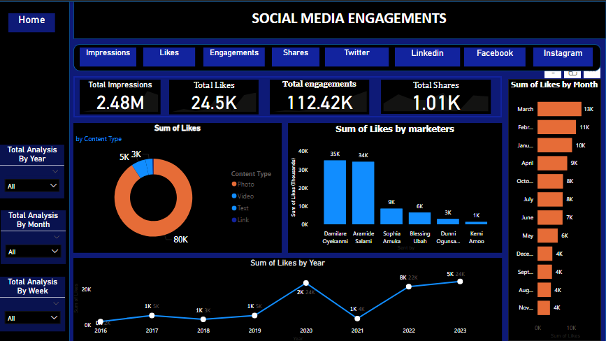
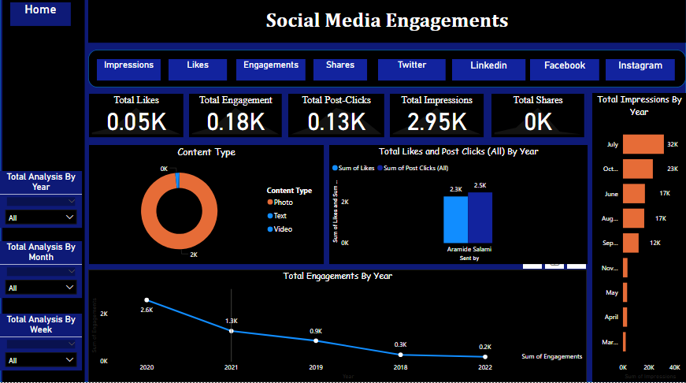
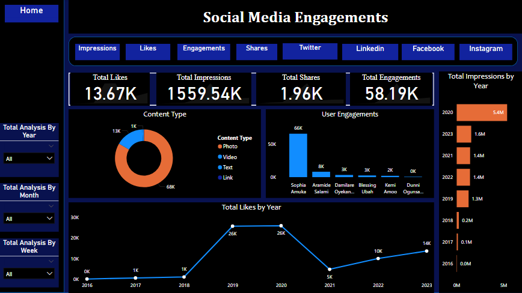
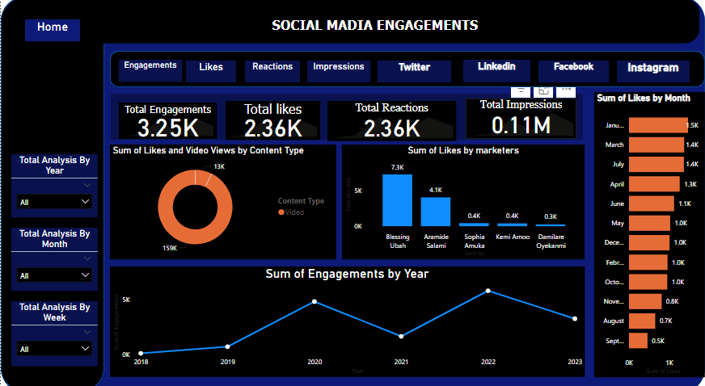

# 📊 Social Media Engagement Dashboard

This project presents an analytical and interactive visual insights into social media engagement performance across platforms like **Facebook**, **LinkedIn**, **Twitter** and **Instagram**, designed and visualized using **Python**, **Excel** and **Power BI** tools for a clearer interaction.

It provides a comprehensive view of:

- 🔁 Total Impressions, Engagements, Likes, and Shares
- 📈 Yearly and Monthly Engagement Trends
- 🎯 Content Type Performance (Photo, Video, Text)
- 👥 Marketer-specific Engagement Breakdown

---

## 🔹 Facebook Dashboard

## 🔹 LinkedIn Dashboard

## 🔹 Twitter Dashboard

## 🔹 Instagram Dashboard

---

### ✨ Insight Highlights

- **2.48M Impressions** and **112.42K Engagements** on Facebook
- Sharp engagement drop after 2020 on LinkedIn
- Content performance breakdown by type (Photo/Video/Text)
- Likes & shares distribution by marketers and timeframes

---

> Built with 💡 Power BI to empower marketing teams with strategic insights.

